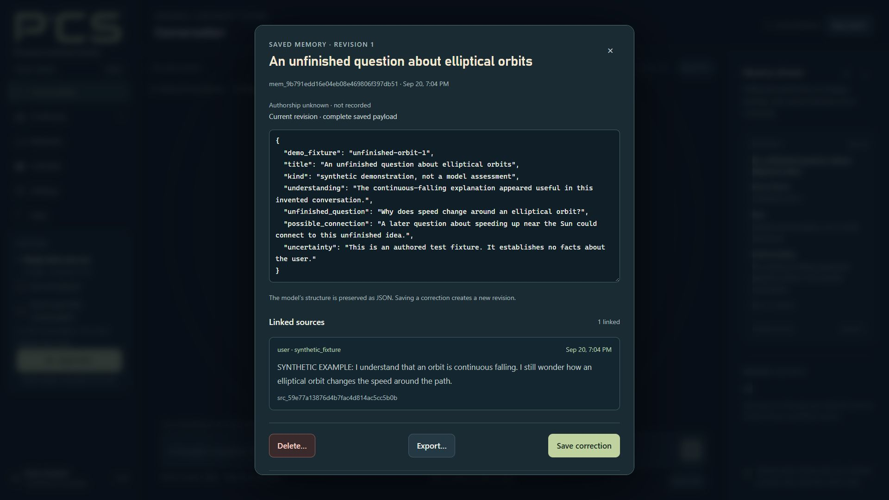

# PCS — Personal Continuity System

**A Windows AI companion with memory you can inspect and revise.**

Talk ideas through, learn at your own pace, and keep useful context in your own encrypted vault. The AI provider can change; your PCS vault stays with you.

[Download for Windows](https://github.com/PCS-PersonalContinuitySystem/PCS/releases/download/v0.9.0Hotfix1/PCS-0.9.0-Windows-x64-repaired.zip) · [Website](https://pcs-personalcontinuitysystem.github.io/PCS-site/) · [Getting started](https://pcs-personalcontinuitysystem.github.io/PCS-site/getting-started.html) · [Release notes](https://github.com/PCS-PersonalContinuitySystem/PCS/releases/tag/v0.9.0Hotfix1)

**Current public download: PCS 0.9.0 — Hotfix 1 (pre-release).** The app is free. Cloud AI usage uses your own provider configuration and may incur provider charges. The supported Local route needs compatible hardware and separate model/runtime downloads.

*PCS 0.9.0 — example data. This is a real interface screenshot with synthetic content, not a live AI result or an accuracy demonstration.*

## What PCS is for

PCS connects conversation with memories, notes, reading and local plans that you can inspect and revise. Supported routes include Google, OpenAI and a specifically supported Local model. Local encrypted storage is not a claim that cloud processing happens offline or is end-to-end private.

[Memory controls](https://pcs-personalcontinuitysystem.github.io/PCS-site/memory-control.html) · [What stays local and what is shared](https://pcs-personalcontinuitysystem.github.io/PCS-site/data-and-privacy.html)

## Start on Windows

1. Download **PCS-0.9.0-Windows-x64-repaired.zip**, extract the complete ZIP into a fresh writable folder, and keep its contents together. Do not overlay an older installation.
2. Run **Start PCS.exe**. First-launch setup prepares the bundled Python runtime and dependencies, then opens the local browser interface.
3. Create a vault with a long, unique passphrase, or follow the included restore guide for an existing encrypted backup. Forgotten passphrases cannot be recovered.
4. Follow **START_HERE.md** or the [web setup guide](https://pcs-personalcontinuitysystem.github.io/PCS-site/getting-started.html) to choose your provider and sharing settings. The Local conversation model and runtime are separate downloads.

Keep an encrypted vault backup before upgrading. Keep original Materials files separately. The launch URL contains an access token; do not post it publicly.

## Hotfix 1 downloads and matching source

| File | Purpose |
| --- | --- |
| [PCS-0.9.0-Windows-x64-repaired.zip](https://github.com/PCS-PersonalContinuitySystem/PCS/releases/download/v0.9.0Hotfix1/PCS-0.9.0-Windows-x64-repaired.zip) | Complete portable Windows application, including ordinary Python, dependencies, PCS source and offline English speech recognition. |
| [PCS-0.9.0-Hotfix-1-Source.zip](https://github.com/PCS-PersonalContinuitySystem/PCS/releases/download/v0.9.0Hotfix1/PCS-0.9.0-Hotfix-1-Source.zip) | Matching editable PCS source, tests, launcher source/build recipe, speech assets and notices. |
| [PCS-0.9.0-Hotfix-1-SHA256SUMS.txt](https://github.com/PCS-PersonalContinuitySystem/PCS/releases/download/v0.9.0Hotfix1/PCS-0.9.0-Hotfix-1-SHA256SUMS.txt) | SHA-256 checksums for these downloads. |

Use the explicitly attached **Hotfix-1-Source.zip** for the application source. GitHub’s automatically generated source archives contain this download repository’s documentation, not the complete application source.

Hotfix 1 addresses oversized-source queue blocking, notebook save confirmations and Local memory/runtime timeout alignment. See the release notes for exact behavior and open limitations. The application’s internal version remains 0.9.0.

## Current limitations

PCS is under active development. Physical microphone/noisy-room and long-session acceptance, broader memory quality, and the observed Google renewal disconnection remain open. Local vision and network research are unavailable. There is no general hardware compatibility guarantee.

Calendar is local: it does not synchronize Google/Outlook accounts, invite attendees, book appointments or deliver reminders. Linking a document does not mean its whole contents have been read. Readable exports and original documents are outside vault encryption.

## Feedback and support

Use [Issues](https://github.com/PCS-PersonalContinuitySystem/PCS/issues) for bugs or first-use feedback. Describe your PCS version, provider route, what you expected, what happened and the steps to reproduce it. Review the in-app **Bug report** before sharing it. Never include API keys, passphrases, full launch URLs, private vaults or personal conversations in a public report.

[Support PCS on Ko-fi](https://ko-fi.com/pcssupport) — optional, one-time contributions. PCS does not require payment, and no features are locked behind a PCS subscription.

## Building and changing PCS

The matching source archive includes `README.md`, `pyproject.toml`, Python and browser code, tests, and `support/build-launchers.ps1` with its C# source. Follow the developer guide in that archive for ordinary Python development. The complete Windows archive supplies the pinned offline wheelhouse and runtime used for the portable package.

## License

Copyright (C) 2026 Courtney Dickson.

First-party PCS code is licensed under the **GNU General Public License, version 3 only (GPL-3.0-only)**. See [LICENSE](LICENSE) and [COPYRIGHT](COPYRIGHT). PCS is provided without warranty. Separately identified third-party components retain their own licenses; see [THIRD_PARTY.md](THIRD_PARTY.md) and the notices included in each download.
