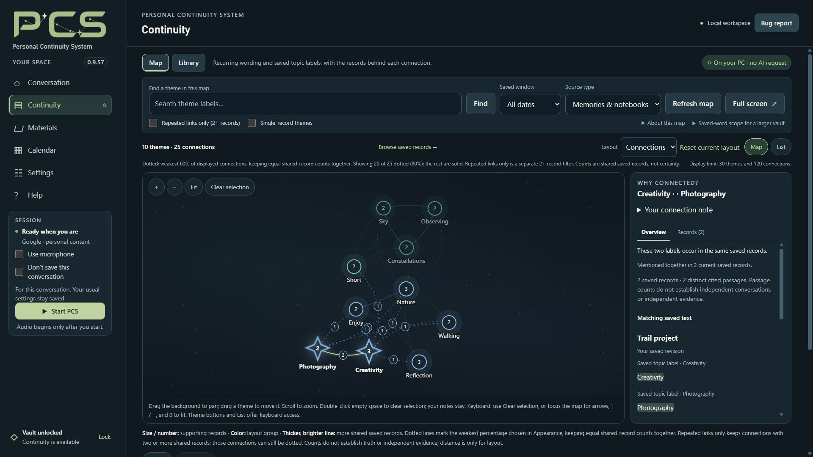
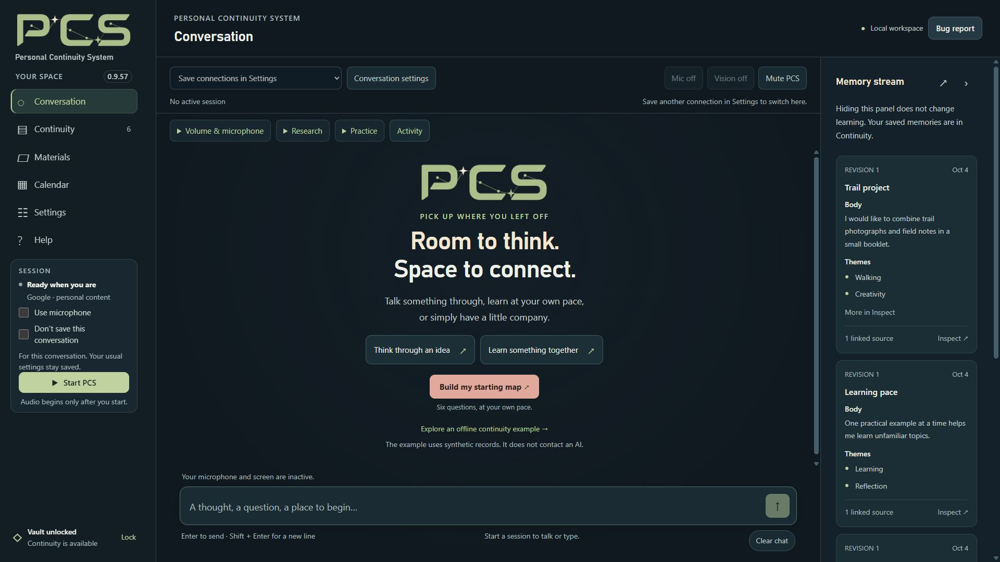

# PCS — Your personal thinking space

**Room to think. Space to connect.**

Personal Continuity System (PCS) brings together AI conversation, learning, reading, and everyday plans. Return to an idea, explore a question, or work through something at your own pace, with saved conversations, revisable memories, and notebooks in your local encrypted vault.

**[Download PCS 0.9.59 for Windows][windows]** · [Release notes][release] · [Website][website] · [Discord][discord] · [Report an issue][issues]

> **0.9.59 · Pre-release · Windows x64**  
> Free, with no PCS subscription or locked features. Cloud providers may charge for API usage. Local AI uses your hardware and separately downloaded components.

## What's new in 0.9.59

The first release since 0.9.57 brings together simpler research, conversation fixes, and a fuller Map.

- **Research stays in the conversation.** With web research enabled, look up controls, DLC, hardware compatibility, settings, or unrelated questions without extra activity approval or a conversation restart. Activity or progress changes alone no longer interrupt an ongoing public lookup.
- **More of your Map at once.** Adaptive display limits increase from 30 to **60 nodes** and from 120 to **300 connections**, depending on your records and filters.
- **Small conversation improvements.** “Local reply stopped…” begins fading after **six seconds**, leaving your draft and conversation open. **Balanced** is the default OpenAI turn-taking setting; existing saved choices are preserved.
- **Reliability fixes.** Improved audio buffering, Google session-renewal handling, and research cancellation, with less blocking work during saved research-note reads.

See the [full release notes][release] for details.

## Follow the connections in your thinking

*Actual 0.9.57 interface with fictional demonstration records. [Full-size image](assets/pcs-map-0.9.57.jpg).*

The **Continuity Map** connects recurring wording and topics across saved memories and notebooks. Follow a connection to inspect its records, compare themes, or prepare a thought to continue in Conversation.

Choose **Focus rings**, **Compare**, **Grid**, **Saved-date**, or other layouts. Recenter a focus, retrace your steps with Back and Forward, arrange nodes, save named views, and add your own connection notes. Full screen and List offer different ways to explore.

The Map can show up to **60 nodes and 300 connections**, depending on the available records and filters. Curved links and their numbers show supporting saved records within a bounded sample. They do not establish confidence, causes, or a personality profile. Browsing the Map needs no running AI conversation.

## A gentle place to begin

**Build my starting map** opens six introductory questions about your interests, priorities, projects, and preferred kind of help, with optional deeper topics. Ask PCS to take them one at a time; skip, redirect, correct, or stop whenever you like.

Preview the introduction locally, download it for Materials, or place it into an empty conversation draft. You review and send it yourself. Normal learning settings apply during the conversation, including before the recap; immediate Map stars are not promised.

See the starting-map button

*Actual interface with fictional test records; no live AI conversation is shown.*

## Memory you can inspect and revise

With saving and learning enabled, PCS retains original passages and uses your selected memory model to form interpretations linked to those sources. **Saving a conversation and forming memories are separate steps.** Saving & memory health shows pending work and problems.

In **Inspect**, correct a memory in ordinary language: **Incorrect**, **Changed**, **Applies in a specific context**, or **Forget**. Review the effect before saving. Your corrections remain distinct from model-written accounts; sources, authorship, and earlier wording stay inspectable. Forget reviews dependent saved work. Advanced JSON editing is also available, with independent draft recovery.

Recall selects context within your sharing permissions and model limits. Required corrections travel with the relevant evidence. **Find references in saved conversation passages** can find details that never became a memory, when original-passage sharing is allowed. Optional **Search by meaning** complements word search.

Memories and replies can still be mistaken, and recall can miss useful details. [See how memory formation and recall fit together](assets/pcs-memory-flow-0.9.57.svg).

## Context for the activity in front of you

Use **Activity** to describe a game, book, film, series, or real-life situation, including progress and the kind of help you want. Optional automatic following can recognize an activity from your current words; it does not grant memory permission.

**Enabled public web research remains available during activities**, including while automatic following is waiting or pending. Your title, edition, and known progress guide relevant story answers. PCS is instructed to ask before revealing later story events unless you clearly request them; a specific request does not change your saved preference. Spoiler avoidance is best effort: search snippets and model answers can still reveal details.

Public queries stay narrow; PCS does not automatically attach personal memories, private situation details, or conversation history.

**Saved-memory permissions are separate.** For spoiler-limited stories, review and approve the complete saved accounts PCS may use. Approvals belong to the exact activity and accounts you reviewed; changed accounts require review again. After an activity is established, changes to its title or progress require a fresh conversation before PCS uses the updated saved-memory context. Public web research does not require that restart or grant access to saved memories. Approval controls supplied memories; it cannot erase context already sent.

**Explore another perspective** offers neutral questions using a question and up to six memories you select. Inspect or remove accounts before sharing, then save only a question you choose, with its attribution and references. **Why this?** shows recent memory handoffs without claiming to explain every response.

## Read, learn, and organize

| Workspace | What you can do |
| --- | --- |
| **Conversation** | Talk or type, customize the companion's directions, and optionally share a selected OBS scene on supported routes. |
| **Materials** | Read supported PDF, EPUB, Office, OpenDocument, RTF, subtitle, HTML, and common text/code files. Review extraction coverage and prepare reading notes. |
| **Read along** | Listen to extracted PDF or saved web text with an available local browser/OS voice, pause at section boundaries, prepare a discussion draft, and resume reading. |
| **Notebooks** | Keep your own goals, notes, lessons, and source references together. |
| **Research and Practice** | Explore questions and work through exercises while keeping source evidence, model explanations, your answers, and corrections distinguishable. |
| **Calendar** | Manage local tasks, goals, and events manually or with separately enabled assistance. |

Reading bookmarks are encrypted and tied to their exact source extraction. Review or remove old positions through **Saved reading bookmarks**, even when an original file has changed or disappeared.

**Web sources** can retain readable public pages, PDF/EPUB sources, RSS/Atom feeds, and selected GitHub, MediaWiki, and Stack Exchange responses. Review the preview and coverage before saving. Research citations can open **Read / save source** with the address filled in. Downloads require an explicit choice, including when using Local AI. Sign-ins and pages requiring script rendering are outside static capture; scans need OCR elsewhere.

**Proactive help is Off by default.** If enabled after reviewing its model and inputs, quiet offers use permitted screen observations, wait around conversation activity, expire, and can be dismissed or paused. Tutoring can offer concepts, hints, or a different practice task; full solutions require a separate request. AI explanations still need review.

Manual reading, notebooks, Calendar, and saved-record browsing work without starting a conversation.

## Choose your AI connection

**Google or OpenAI:** use your own API key, choose a compatible model, and save named setups. API access and billing are separate from a ChatGPT or other chat subscription. Review your provider's terms and the content-sharing choices shown in PCS. OpenAI turn-taking defaults to **Balanced** when no preference has been saved; existing choices are kept.

**Local on this PC:** the established Windows CUDA route requires a compatible NVIDIA GPU. **Settings → Connections → Local model & files** guides the recommended Gemma setup or experimental **Custom GGUF**. Custom models need compatibility checks. Save up to eight named Custom setups with model, runtime, optional projector, context, and speech choices, then switch enabled profiles while stopped.

Local conversation and memory have **no cloud AI fallback**. Typed use needs no speech pack. Optional offline English listening and Windows or Kokoro speech provide voice. Local OBS vision requires a matching projector. Models, AI runtimes, projectors, and speech packs remain separate downloads; keep them outside the app folder for reuse across upgrades.

Optional **Search by meaning** uses a separate Nomic model and CPU runtime without cloud embeddings. Its temporary index stays in RAM and clears at Lock; word search remains available during indexing or failure. Optional **Brave lookup** uses its own key and sends queries and public-page requests online. Separately approved cloud preparation sends the reviewed material to its displayed provider.

**Alibaba Qwen** is an experimental cloud voice-only route with regional setup, permitted OBS images, and supported PCS tools. Typed chat, web/Study research, and saved practice are unavailable; memory processing needs a supported helper.

**Platform previews:** Windows Radeon Vulkan is a 16K text-only preview requiring real-hardware qualification. It does not provide the CUDA route's full feature set. The source includes an Ubuntu 24.04 x64 browser/cloud preview; native Local AI and desktop integrations remain limited or unavailable. Linux target acceptance is still needed. macOS is not included.

## Download and start

| Download | Choose this for |
| --- | --- |
| **[PCS-0.9.59-Windows-x64.zip][windows]** | Complete portable application, Windows launchers, bundled Python, pinned dependencies, PCS source, and offline Help. |
| [PCS-0.9.59-Source.zip][source] | Matching editable source, tests, documentation, and build support. |
| [PCS-0.9.59-SHA256SUMS.txt][checksums] | SHA-256 checksums for both archives. |

Most people need the **Windows ZIP**. GitHub's automatic **Source code (zip)** contains this download repository, not the complete application.

1. Verify and extract the complete ZIP into a fresh writable folder. Keep its files together; do not overlay an older installation.
2. Open **Start PCS.exe**. First launch prepares bundled Python offline and opens PCS in your browser. No system Python installation is needed.
3. Create a vault and keep its passphrase safe; PCS cannot recover it. Existing users should follow [Updating and backups](#updating-and-backups).
4. Open **Settings → Connections**, configure a route, review learning and sharing choices, and save. Leave the microphone off for your first typed check with Google, OpenAI, or Local, then choose **Start PCS**.

The [0.9.59 release notes][release] cover the combined changes since 0.9.57. Setup details are in `START_HERE.md` and `docs/GETTING_STARTED.md` inside the download.

## Your information and your choices

- **Storage and sharing are separate.** Saved continuity lives in your encrypted vault. Original Materials files and readable exports are outside vault encryption. Enabled cloud features receive the permitted content shown by their controls.
- **Saving controls have specific scopes.** Don't save this conversation controls new PCS saving; it does not prevent provider disclosure. Clearing chat or hiding the memory stream does not stop learning.
- **Check important results.** Review transcripts, save confirmations, and saved records. Corrections and deletion cannot retract earlier provider disclosure or erase old backups.
- **Exit through PCS.** Stop ends the conversation and capture; Lock closes vault access. Use **Quit PCS** and wait for **PCS closed** to shut down the host. Closing the tab alone can leave it running. Keep the full launch URL private because it contains an access token.

## Updating and backups

Keep an encrypted backup, the previous application folder, and your passphrase. Copy original Materials separately. Quit PCS, extract the new version into a fresh folder, and follow `docs/RESTORE_VAULT.md`: restore into the empty installation before creating a new vault, or copy the complete stopped data folder. Never run two installations against one data directory.

Some saved features raise the minimum version that can reopen the vault. Since 0.9.50, model-written revisions can require **0.9.51**; new Web extraction records, reading bookmarks, saved reflections with memory dependencies, and non-default Local backend settings can require **0.9.53**; saved activity approvals require **0.9.54**. Opening or browsing alone does not activate these requirements. Keep the pre-upgrade backup for rollback; 0.9.59 introduces no additional vault format or minimum-reader requirement.

Native Save As, automatic backups, and in-app restore support **2 GiB** vaults. **Check for updates** is manual and never installs an update automatically.

## Help and feedback

Open **Help** inside PCS or `docs/HELP.html` for 57 searchable guides, current screenshots, and diagrams. The package also includes guides for reading, activity memory, Map navigation, backup, and recovery.

PCS remains a pre-release. Memory formation, activity recognition, reflection questions, transcription, and replies can be wrong. Calendar has no external account sync or reminders. The release has undergone automated tests, offline setup, synthetic lifecycle checks, independent review, and archive verification. These checks do not establish live-provider, physical-device, model-quality, or long-session acceptance.

Report bugs through [GitHub Issues][issues] or [Discord][discord]. Include the version, connection route, reproduction steps, and expected versus actual behavior. Download **Bug report before quitting**, review it, and remove private information before sharing. Never post keys, passphrases, launch tokens, or private vaults.

## Support PCS

PCS has no paid features. Optional contributions help support development; AI-provider charges are separate.

[][kofi]

## Source and license

This repository hosts downloads, documentation, and issues. **Application source is attached to each release.** Download the matching [Source ZIP][source] and follow `SOURCE_README.md` and `docs/developer/README.md`. Use synthetic data and disposable vaults for development.

Copyright (C) 2026 Courtney Dickson. First-party PCS code is **GPL-3.0-only**, without warranty. See [LICENSE](LICENSE), [COPYRIGHT](COPYRIGHT), and [THIRD_PARTY.md](THIRD_PARTY.md). Separately identified components retain their own terms.

[windows]: https://github.com/PCS-PersonalContinuitySystem/PCS/releases/download/v.0.9.59/PCS-0.9.59-Windows-x64.zip
[source]: https://github.com/PCS-PersonalContinuitySystem/PCS/releases/download/v.0.9.59/PCS-0.9.59-Source.zip
[checksums]: https://github.com/PCS-PersonalContinuitySystem/PCS/releases/download/v.0.9.59/PCS-0.9.59-SHA256SUMS.txt
[release]: https://github.com/PCS-PersonalContinuitySystem/PCS/releases/tag/v.0.9.59
[website]: https://pcs-personalcontinuitysystem.github.io/PCS-site/
[discord]: https://discord.com/invite/2ssCQhNgAN
[issues]: https://github.com/PCS-PersonalContinuitySystem/PCS/issues
[kofi]: https://ko-fi.com/pcssupport
