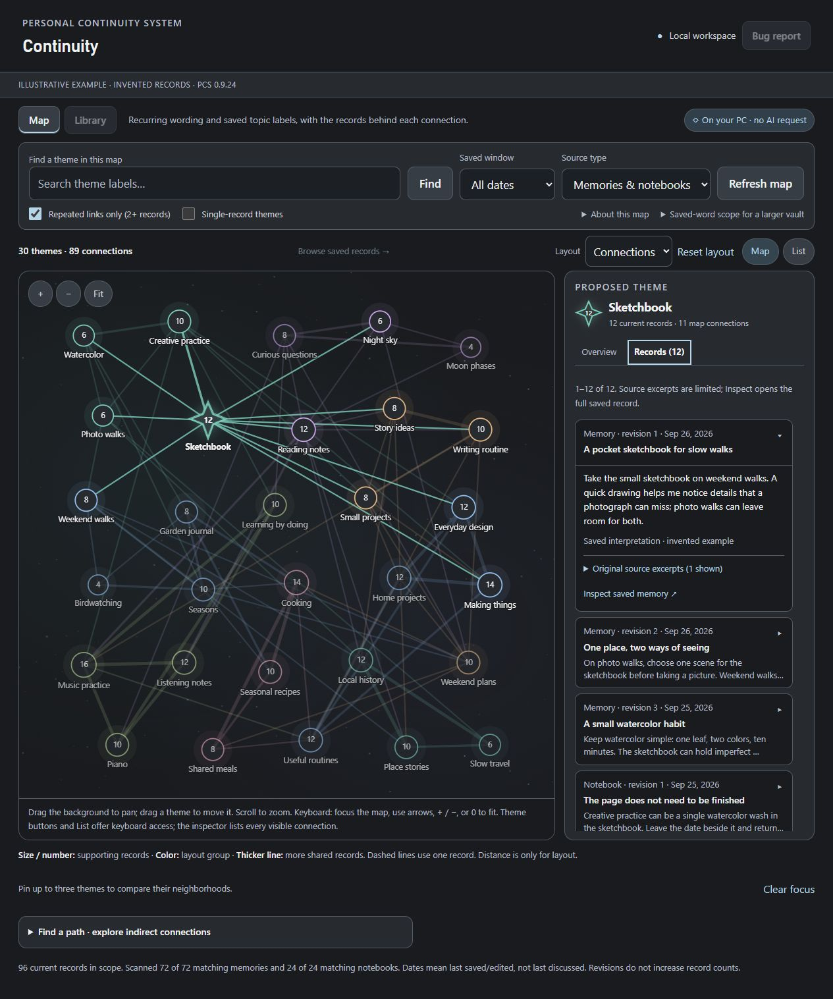

# PCS — Your personal thinking space

**Room to think. Space to connect.**

Personal Continuity System (PCS) is a Windows AI workspace for conversation, learning, reading, and everyday plans. Talk an idea through, return to a project, or explore a question together—with saved continuity you can inspect, correct, and revisit in your own encrypted vault.

**[Download PCS 0.9.33 for Windows][windows]** · [Release notes][release] · [Website][website] · [Discord][discord] · [Report an issue][issues]

> **0.9.33 · Pre-release · Windows x64**  
> Free, with no PCS subscription or locked features. Cloud providers may charge for API usage. Local AI uses your hardware and separately downloaded components.

## Follow the connections in your thinking

[][website]

*30 themes, 89 connections, and 96 fictional saved records, shown in the 0.9.24 interface. [Open the full-size image](assets/pcs-thought-map-sample.jpg).*

The **Continuity Map** helps you explore recurring wording and topics across saved memories and notebooks. Inspect the records behind a theme, follow connections, compare saved-date windows, or review a **Continue this thought** draft in Library.

Arrange nodes and save their positions in your encrypted vault. Choose **Connections**, **By group**, or **Circle**, pin themes, or use the accessible List view. Browsing needs no running AI conversation.

The Map covers a bounded sample of current saved records. Connections show themes appearing together; they do not establish causes, agreement, or a psychological profile.

## What you can do

| Workspace | Make it useful to you |
| --- | --- |
| **Conversation** | Talk or type using Google, OpenAI, or Local AI. Customize the companion's directions and optionally share a selected OBS scene on supported routes. |
| **Continuity** | Inspect memories, sources, and revision history. Correct interpretations, review deletion scope, and explore Library and Map. |
| **Materials and notebooks** | Read TXT, Markdown, selectable-text PDF, or EPUB documents. Prepare reading notes, collect sources, keep bookmarks, and organize your own notes and lessons. |
| **Research and Practice** | Explore questions and work through exercises, keeping original evidence, model explanations, your answers, and corrections distinguishable. Supported routes can retain Wikipedia study notes. |
| **Calendar** | Manage local tasks, goals, and events in Month or Agenda view, manually or with separately enabled assistance. |
| **Backup and control** | Save encrypted backups, restore into an empty installation, and optionally enable automatic backups and vault locking. |

Browse saved records, read Materials, and use manual Calendar and notebook controls without starting a conversation. Switch supported providers while keeping the same vault. Saved memory remains revisable; it is not a guarantee that an AI will recall everything correctly.

## What's new since 0.9.24

- **Safer editing:** better protection for notebook annotations, bookmark notes, and memory corrections; clearer review of uncertain saves; duplicate-safe notebook creation.
- **Better Local controls:** **Stop thinking** cancels the current reply and pending lookup while retaining the session when cleanup succeeds. **Skip speech** cancels unfinished speech while keeping completed text and confirmed saved actions.
- **More flexible setup:** compatible Google/OpenAI model IDs beyond the suggestions, setup-only connection tests, improved Custom GGUF checks, optional resident NVIDIA GPU Whisper, and clearer GPU capacity warnings.
- **Improved sources and privacy:** pasted web text in Local mode, clearer download errors, stronger source tracking and stale-response checks, and revocation of pending screenshots when Vision is turned off.
- **Less repeated work:** more efficient Materials updates, notebook and Calendar saves, and memory, Map, and Library browsing.
- **Larger backups:** native Save As, automatic backups, and restore support the full **2 GiB** physical vault limit.

See the [0.9.33 release notes][release] for the combined update.

## Download and start

| Download | Choose this for |
| --- | --- |
| **[PCS-0.9.33-Windows-x64.zip][windows]** | The complete portable application, including Windows launchers, Python, pinned application dependencies, PCS source, and offline Help. |
| [PCS-0.9.33-Source.zip][source] | Matching editable source, tests, documentation, and build support. |
| [PCS-0.9.33-SHA256SUMS.txt][checksums] | SHA-256 checksums for both downloads. |

Most people need the **Windows ZIP**. GitHub's automatic **Source code (zip)** contains this download repository, not the full application. Keep the extracted package together: PCS verifies its manifest when launching.

1. **Download, verify, and extract** into a fresh writable folder. Do not run inside an archive viewer or overlay an older installation.
2. Open **Start PCS.exe**. First launch prepares bundled Python offline and opens PCS in your desktop browser. No system Python installation is required.
3. **Create a vault** and keep its passphrase safe. PCS cannot recover a forgotten passphrase. Existing users should follow [Updating and backups](#updating-and-backups).
4. In **Settings → Connection**, choose Google, OpenAI, or **Local on this PC**. Configure the route, review learning and sharing choices, and save.
5. Try a short typed message. Enable **Use microphone** before Start when you want voice, and enable other sharing as needed.

### Choose your connection

**Google or OpenAI:** bring your own API key and check the provider's billing, limits, and data-use terms. Compatible model IDs can be entered manually; account access and protocol compatibility still apply. Advanced connection tests contact the selected provider to check setup without sending a personal conversation. They do not test replies, devices, or tool behavior.

**Local on this PC:** follow the guided Gemma setup or select an experimental **Custom GGUF** profile with a compatible runtime. Custom profiles require **Check compatibility** before Save or Start. The current Local conversation route requires compatible Windows/NVIDIA hardware; capacity needs depend on the model and selected features. Local conversation and memory have no cloud AI fallback.

Models, AI runtimes, vision projectors, and speech packs are **separate optional downloads**. Keep their folders outside the installation to reuse them across upgrades. Typed Local use needs no speech pack. Microphone input needs the English recognition pack; replies can use an installed Windows voice or optional Kokoro CPU/NVIDIA GPU voice.

Optional **OBS vision** uses a scene you choose and requires a separate OBS installation. Optional **Brave lookup** requires its own API key and explicit permission: queries and public-page requests leave the computer, while the selected model interprets results locally. Generated queries can contain conversation details, so use public topics. Preparation and notebook-outline requests have their own visible provider choice; separately approved cloud preparation is still a cloud request.

## Your information and your choices

- **Local storage and cloud sharing are separate.** Enabled cloud features can receive conversation, permitted memories, document passages, Calendar details, or selected OBS images. Review the displayed provider and sharing settings.
- **Your vault is encrypted.** It holds saved continuity, notebooks, prepared notes, Calendar records, web snapshots and bookmarks, remembered settings and credentials, and Map layout. Original Materials files and readable exports are outside vault encryption.
- **Saving controls have specific scopes.** **Don't save this conversation** controls new PCS saving; it does not prevent provider disclosure or disable every sharing choice. Clear chat clears the display. Hiding the memory stream does not stop learning.
- **Check important outcomes.** Transcription, answers, and memory interpretations can be wrong. Check the PCS save result and saved record rather than relying on a model's claim. Deletion cannot retract earlier provider disclosure or erase old backups.
- **Exit through PCS.** Stop ends the conversation and capture; Lock also closes vault access. Use **Quit PCS** and wait for **PCS closed** to shut down the host. Closing the browser tab alone can leave it running. Keep the full launch URL private: it contains an access token.

## Updating and backups

**Keep your earlier installation, its passphrase, and a verified pre-upgrade backup. Quit PCS before moving its data.** Extract the new version into a fresh folder; it does not automatically locate older data.

Choose either:

- **Encrypted backup and restore:** save and check a backup, then restore into the fresh installation before creating a new vault. Copy original Materials separately, preserve filenames and folders, and refresh documents while stopped.
- **Complete stopped-folder copy:** after clean shutdown, copy the entire old data folder beside **Start PCS.exe** in the fresh extraction. Keep the original, then unlock and verify the copy. Use the actual data directory if you configured a custom location.

Do not merge vaults or run two installations against the same data directory. Reselect the automatic-backup destination after moving or restoring. Automatic backups run only while PCS is open, connected, unlocked, and stopped, with saving allowed; **Don't save** pauses backups. All copies are retained until you remove them.

Native Save As backup, automatic backup, and in-app restore support **2 GiB** vault files. The compatibility browser-download endpoint retains its **256 MiB** limit; normal backup uses native Save As. Wait for confirmation—an unconfirmed save is not a verified backup.

Some saved features raise the minimum PCS version that can reopen a vault and its later backups. New notebook creation receipts require **0.9.31 or newer**; clearing a choice does not lower an already-recorded requirement. Keep the pre-upgrade copy for rollback and follow **`docs/RESTORE_VAULT.md`** inside the download.

## Help, limits, and feedback

Open **Help** inside PCS or **`docs/HELP.html`** for searchable offline guidance. The download also includes:

- **`START_HERE.md`** and **`docs/GETTING_STARTED.md`** — setup and first use.
- **`docs/RESTORE_VAULT.md`** — backups, upgrades, and recovery.
- **`docs/CONTINUITY_MAP.md`** — Map navigation and evidence.
- **`docs/RELEASE_NOTES.md`** — release changes.
- **`docs/developer/README.md`** — development and testing.

PCS remains a **pre-release**. Hardware compatibility, recognition quality, provider limits, and long conversations can affect results. Calendar does not sync external accounts, send invitations, or deliver reminders. Web capture handles bounded public static pages, not interactive sites or sign-ins.

For 0.9.33, **7,448 Python tests and 1,463 JavaScript tests passed**, with two Windows symlink-permission skips. Offline installation, two synthetic lifecycle cycles, 13 synthetic browser checks, and independent archive verification passed. These checks do not establish personal-vault, live-provider, real-model, microphone/GPU/OBS, desktop-shortcut, or long-session acceptance.

Report bugs through [GitHub Issues][issues] or [Discord][discord]. Include the PCS version, connection route, reproduction steps, and expected versus actual behavior. Download **Bug report before quitting** when possible, review it, and remove private information before sharing. Never post keys, passphrases, launch tokens, or private vaults.

## Support PCS

PCS is free, with no subscription or features locked behind payment. Contributions are optional and help support development. AI-provider charges are separate.

[][kofi]

## Source and license

This repository hosts releases, documentation, and issues. **The application source is attached to each release.** Download the matching [Source ZIP][source] and follow `SOURCE_README.md` and `docs/developer/README.md`. The Windows ZIP additionally supplies the pinned runtime, offline wheelhouse, and compiled launchers. Use synthetic data and disposable vaults for development.

Copyright (C) 2026 Courtney Dickson. First-party PCS code is licensed under **GNU GPL version 3 only (GPL-3.0-only)**. See [LICENSE](LICENSE) and [COPYRIGHT](COPYRIGHT). PCS is provided without warranty. Separately identified components retain their own terms; see [THIRD_PARTY.md](THIRD_PARTY.md) and the notices in each download.

[windows]: https://github.com/PCS-PersonalContinuitySystem/PCS/releases/download/v0.9.33/PCS-0.9.33-Windows-x64.zip
[source]: https://github.com/PCS-PersonalContinuitySystem/PCS/releases/download/v0.9.33/PCS-0.9.33-Source.zip
[checksums]: https://github.com/PCS-PersonalContinuitySystem/PCS/releases/download/v0.9.33/PCS-0.9.33-SHA256SUMS.txt
[release]: https://github.com/PCS-PersonalContinuitySystem/PCS/releases/tag/v0.9.33
[website]: https://pcs-personalcontinuitysystem.github.io/PCS-site/
[discord]: https://discord.gg/558hSvYp4
[issues]: https://github.com/PCS-PersonalContinuitySystem/PCS/issues
[kofi]: https://ko-fi.com/pcssupport
