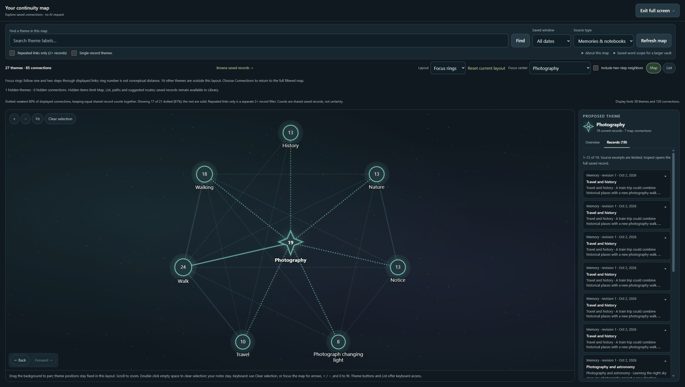
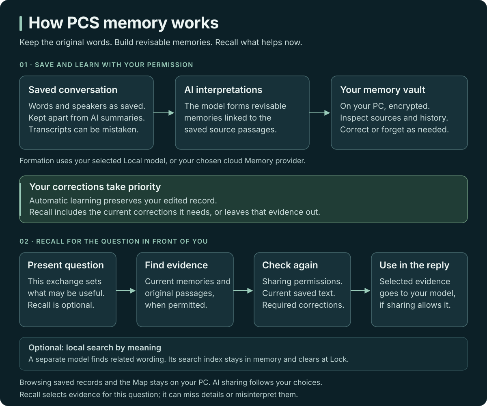

# PCS — Your personal thinking space

**Room to think. Space to connect.**

Personal Continuity System (PCS) combines AI conversation, learning, reading, and planning on Windows, with saved conversations, revisable memories, and notebooks in your encrypted vault.

**[Download PCS 0.9.50 for Windows][windows]** · [Release notes][release] · [Website][website] · [Discord][discord] · [Report an issue][issues]

> **0.9.50 · Pre-release · Windows x64**  
> Free, with no PCS subscription or locked features. Cloud providers may charge for API usage. Local AI uses your hardware and separately downloaded components.

## Follow the connections in your thinking

*Fictional demonstration in the actual 0.9.50 interface. [Full size](assets/pcs-map-0.9.50.jpg).*

The **Continuity Map** connects wording and topics in memories and notebooks. Inspect records, compare groups, and review a draft to place in Conversation.

Use full screen, **Focus rings**, **Compare**, **Grid**, or **Saved-date** layouts. Save views and connection notes, arrange/hide items, and navigate Back/Forward or through List. Browsing needs no running AI.

Connections show themes together in a bounded sample. Saved-date means when records were saved/edited. Your notes stay separate from suggested evidence.

## Memory you can inspect and revise

*[View the memory diagram at full size](assets/pcs-memory-flow.svg).*

With saving and learning enabled, PCS retains originals and forms source-linked interpretations using your memory model. **Saving and memory formation are separate steps.** Saving & memory health shows pending work and problems.

Inspect sources and history, then correct interpretations. Automatic formation preserves your corrections. Recall keeps required current corrections with their evidence and withholds incomplete combinations.

Conversations receive selected context within your permissions and model limits. **Find references in saved conversation passages** can recover details that never became a memory, with permission to share originals. **Search by meaning** complements word search.

Recall can miss something or choose no callback. Interpretations remain revisable, with originals available for inspection.

## What you can do

| Workspace | Make it useful to you |
| --- | --- |
| **Conversation** | Talk or type, customize directions, and optionally share an OBS scene. |
| **Continuity** | Inspect memories, sources, and corrections in Library and Map. |
| **Materials and notebooks** | Read TXT, Markdown, selectable-text PDF, or EPUB; prepare notes and organize sources. |
| **Research and Practice** | Explore questions and exercises with distinguishable evidence, explanations, answers, and corrections. |
| **Calendar** | Manage local tasks, goals, and events manually or with permitted assistance. |

Browse records and use manual reading, notebook, and Calendar controls without starting AI. Keep the same vault when switching supported providers.

## Local AI on your PC

**Local conversation requires a compatible NVIDIA GPU.** In **Settings → Connections → Local model & files**, choose recommended **Gemma 4 12B** or experimental **Custom GGUF**. Custom models need compatibility checks for text, tools, structured output, and selected vision. Choose 8K, 16K, or 32K context; smaller windows may not fit every enabled tool.

Save **up to eight named Custom GGUF setups** with model, runtime, projector, context, and speech choices. Switch enabled profiles in Conversation's picker while stopped. Profiles do not carry sharing permissions.

**Search by meaning runs on CPU.** A separate optional Nomic model searches memories and permitted passages without cloud embeddings. Its index stays in RAM and clears at Lock; word search remains available during indexing or failure. CPU search is separate from NVIDIA conversation.

Local conversation and memory have **no cloud AI fallback**. Typed use needs no speech pack. Voice offers offline English recognition on CPU/GPU and Windows or Kokoro CPU/GPU replies. Models, runtimes, projectors, and speech packs are separate downloads; keep them outside the app folder for reuse.

OBS vision needs a selected scene and matching projector. **Brave lookup** needs its own key and sends queries and page requests online; use public topics. Separately approved cloud preparation also sends material to that provider.

## Optional help while you learn

**Proactive help is Off by default.** Review model and inputs to enable quiet offers from permitted screen observations. Offers respect conversation activity, expire, and can be dismissed or paused. Compatible Local models can run this help; screen input needs Local vision.

For tutoring, type or check the problem and current step, then confirm them. Request a concept, hint, or different practice task; full solutions require a separate request. Teaching preferences are revisable. Supported arithmetic and linear equations have exact checks; AI explanations still need review.

## Cloud connections

**Google and OpenAI** use your API key and support compatible manual model IDs and up to eight named cloud setups. Check your provider's access, billing, and data-use terms.

**Alibaba Qwen is experimental cloud voice**, with permitted OBS images and PCS tools. It requires regional setup; typing, research, and saved practice are unavailable. Memory processing needs a selected Google/OpenAI helper.

## Download and start

| Download | Choose this for |
| --- | --- |
| **[PCS-0.9.50-Windows-x64.zip][windows]** | Complete portable application, launchers, bundled Python, pinned dependencies, source, and offline Help. |
| [PCS-0.9.50-Source.zip][source] | Matching editable source, tests, documentation, and build support. |
| [PCS-0.9.50-SHA256SUMS.txt][checksums] | SHA-256 checksums for both downloads. |

Use the **Windows ZIP**. GitHub's automatic **Source code (zip)** contains only this download repository.

1. Verify and extract the complete ZIP into a fresh writable folder.
2. Open **Start PCS.exe**. Bundled Python prepares offline; no system Python is needed.
3. Create a vault and keep its passphrase safe. It cannot be recovered. Existing users: see [Updating and backups](#updating-and-backups).
4. Choose **Settings → Connections**, review learning/sharing, save, and Start. Try a typed message with Google, OpenAI, or Local first.

See [changes since 0.9.33][release] for this release's additions and repairs.

## Your information and your choices

Original Materials and readable exports are outside vault encryption. Cloud features send permitted content to the displayed provider. **Don't save** controls PCS saving, not provider disclosure. Clearing chat or hiding memory does not stop learning.

Check saved results. Deletion cannot retract earlier provider disclosure or erase old backups.

**Stop** ends conversation/capture, **Lock** closes vault access, and **Quit PCS** shuts down the host. Wait for **PCS closed**; closing the tab alone can leave it running.

## Updating and backups

Keep a verified encrypted backup and the previous app folder. Quit PCS and extract into a fresh folder. Follow **`docs/RESTORE_VAULT.md`** to restore before creating a new vault, or copy the complete stopped data folder. Copy Materials separately. Never share one data directory between running installations.

Native Save As, automatic backups, and restore support **2 GiB** vaults. Newer saved features may require a newer reader; retain the pre-upgrade backup for rollback. **Check for updates** checks releases only when requested and never installs automatically.

## Help and feedback

Open **Help** or **`docs/HELP.html`** for offline guidance. **`START_HERE.md`** covers setup.

PCS remains a pre-release. Models and transcription can make mistakes. Calendar has no external sync or reminders; web capture supports bounded public pages.

Report bugs on [GitHub][issues] or [Discord][discord] with version, route, and reproduction steps. Download **Bug report before quitting** and review it before sharing. Never post keys, passphrases, launch tokens, or private vaults.

## Support PCS

Optional contributions support development. PCS has no paid features; AI-provider charges are separate.

[][kofi]

## Source and license

**Application source is attached to each release.** Download the matching [Source ZIP][source]; follow `SOURCE_README.md` and `docs/developer/README.md`.

Copyright (C) 2026 Courtney Dickson. First-party code: **GPL-3.0-only**, without warranty. See [LICENSE](LICENSE), [COPYRIGHT](COPYRIGHT), and [THIRD_PARTY.md](THIRD_PARTY.md). Separately identified components retain their own terms.

[windows]: https://github.com/PCS-PersonalContinuitySystem/PCS/releases/download/v0.9.50/PCS-0.9.50-Windows-x64.zip
[source]: https://github.com/PCS-PersonalContinuitySystem/PCS/releases/download/v0.9.50/PCS-0.9.50-Source.zip
[checksums]: https://github.com/PCS-PersonalContinuitySystem/PCS/releases/download/v0.9.50/PCS-0.9.50-SHA256SUMS.txt
[release]: https://github.com/PCS-PersonalContinuitySystem/PCS/releases/tag/v0.9.50
[website]: https://pcs-personalcontinuitysystem.github.io/PCS-site/
[discord]: https://discord.com/invite/2ssCQhNgAN
[issues]: https://github.com/PCS-PersonalContinuitySystem/PCS/issues
[kofi]: https://ko-fi.com/pcssupport
